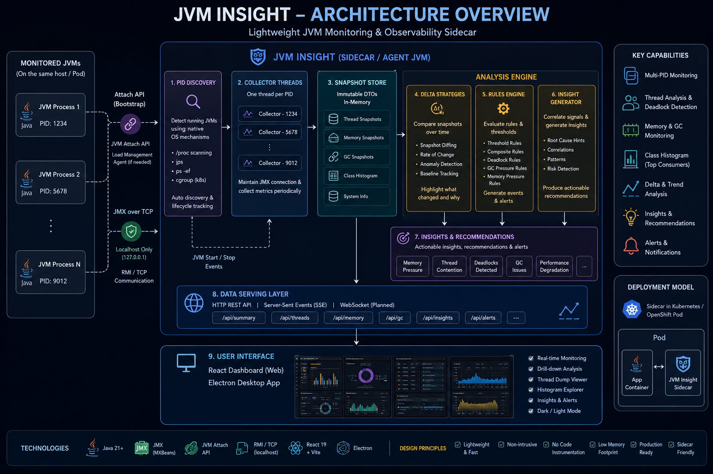

# A-Haythorus


## Overview

JVM A-Haytham is a **lightweight, JVM monitoring tool** designed to observe **multiple running JVM processes** from a single host.


A-Haythorus is a lightweight JVM observability sidecar designed for container and Kubernetes environments.

It attaches to a target JVM through the Java Attach API, collects runtime data through JMX and JVM diagnostic commands, keeps a bounded in-memory history for trend analysis, exposes a REST API, serves a browser UI, and can discover other A-Haythorus sidecars in Kubernetes for peer-to-peer cluster views.

The project is intentionally built with plain Java infrastructure components rather than a large application framework so that the runtime behavior, JVM interaction, networking, discovery, and analysis logic remain explicit and easy to reason about.

---

## 1. Goals

A-Haythorus is built around a few core goals:

- observe a JVM from a sidecar without modifying the monitored application
- collect thread, memory, GC, histogram, CPU, and deadlock information
- preserve a small bounded history for trend analysis
- distinguish short-term movement from long-term retention behavior
- detect suspicious memory-retention patterns using explainable mathematics
- expose local and cluster-wide JVM state through HTTP
- discover sidecar peers dynamically in Kubernetes
- avoid a mandatory central aggregator
- keep the monitoring agent itself lightweight and bounded in memory

---

## 2. High-level architecture

```text
                     Kubernetes / local runtime

  +-----------------------------------------------------------+
  | Pod A                                                     |
  |                                                           |
  |  +-------------------+        +------------------------+  |
  |  | monitored JVM     | <----> | A-Haythorus sidecar    |  |
  |  | application       |  JMX   |                        |  |
  |  +-------------------+        | collector              |  |
  |                               | datastore              |  |
  |                               | delta engine           |  |
  |                               | leak analyzer          |  |
  |                               | HTTP server            |  |
  |                               | React UI               |  |
  |                               +-----------+------------+  |
  +-------------------------------------------|---------------+
                                              |
                                              | peer HTTP
                                              |
  +-------------------------------------------v---------------+
  | Pod B                                                     |
  |  monitored JVM + A-Haythorus sidecar                     |
  +-----------------------------------------------------------+

                     ^
                     |
            Kubernetes API
            membership discovery
```

A-Haythorus does not require a central collector for cluster operation.

Any sidecar can act as an entry point and aggregate local state with state fetched from discovered peers.

---

## 3. JVM collection model

The collector attaches to the target JVM and reuses the management connection.

A collection cycle gathers data such as:

- heap and non-heap memory
- memory pools
- garbage collector counters
- thread count
- thread CPU time
- parsed thread dump
- deadlocks
- class histogram
- timestamp

Conceptually:

```text
Target JVM
   |
   | Attach API / JMX / DiagnosticCommand
   v
JvmCollector
   |
   v
JvmSnapshot
```

The collector repeats according to the configured interval.

Default:

```text
collector.interval.ms = 5000
```

Environment override:

```text
AH_COLLECTOR_INTERVAL_MS
```

---

## 4. Latest state and bounded history

The datastore keeps two different forms of state for each PID.

```text
JvmDataStore

latest full snapshot
    |
    +-- thread dump
    +-- histogram
    +-- memory
    +-- GC
    +-- CPU
    +-- delta

bounded lightweight history
    |
    +-- timestamp
    +-- heap used
    +-- non-heap used
    +-- old-generation used
    +-- thread count
    +-- GC collection counters
    +-- previous leak confidence
```

The latest full snapshot is used by the REST API and the pairwise delta engine.

Historical entries are stored as lightweight `JvmHistorySample` records so the sidecar does not retain hundreds of thread dumps or histograms in memory.

History is bounded.

Default:

```text
history.max.samples = 120
```

Environment override:

```text
AH_HISTORY_MAX_SAMPLES
```

At the default five-second sampling interval, 120 samples represent roughly ten minutes of retained history.

The actual retained duration is:

```text
retained duration ~= sample interval * maximum samples
```

The buffer removes the oldest sample when the configured capacity is exceeded.

This is important because the monitoring agent must not create its own unbounded memory growth.

---

## 5. Pairwise delta versus historical analysis

A-Haythorus separates two questions.

### Pairwise delta

```text
What changed since the previous sample?
```

For heap:

```text
Delta_heap(t) = H_t - H_(t-1)
```

The delta layer exposes signed movement as well as direction-specific values:

```text
heapDelta
positiveHeapDelta
reclaimedHeapBytes
```

where:

```text
positiveHeapDelta = max(heapDelta, 0)
reclaimedHeapBytes = max(-heapDelta, 0)
```

The same idea applies to non-heap memory.

A positive delta and a negative delta have different meanings and are not treated as equivalent magnitudes.

### Historical analysis

```text
Has suspicious retention persisted across time?
```

Leak analysis operates over a configurable time window rather than only the latest two observations.

Default:

```text
leak.window.seconds = 60
```

Environment override:

```text
AH_LEAK_WINDOW_SECONDS
```

The analyzer selects history points using timestamps:

```text
sample.timestamp >= current.timestamp - configured window
```

Therefore changing the collection interval changes the number of samples available in the window without changing the semantic meaning of the window itself.

For example:

```text
interval = 5 seconds, window = 60 seconds -> about 12 samples
interval = 2 seconds, window = 60 seconds -> about 30 samples
```

---

## 6. Persistence

Persistence measures how consistently a metric moves in the suspicious direction across the analysis window.

For heap values:

```text
100 -> 104 -> 108 -> 111 -> 115
```

all four intervals are positive:

```text
+4, +4, +3, +4
```

Therefore:

```text
persistence = 4 / 4 = 1.0
```

For:

```text
100 -> 110 -> 96 -> 108 -> 95
```

the movements are:

```text
+10, -14, +12, -13
```

Only two of four intervals are positive:

```text
persistence = 2 / 4 = 0.5
```

Persistence measures consistency, not magnitude.

A separate net-growth feature measures how much memory actually moved across the window.

Both are needed because:

```text
+1 MB +1 MB +1 MB +1 MB
```

has perfect persistence but small magnitude, while a single `+100 MB` burst has large magnitude but little evidence of persistence if it is reclaimed immediately.

---

## 7. Leak-confidence model

The current leak model is explainable and deterministic.

It combines several independent signals:

```text
heap trend and persistence        30 points
old-generation trend              25 points
GC reclaim/retention evidence     20 points
histogram/object growth           15 points
thread accumulation               10 points
                                  ----------
                                  100 points
```

The combined current-window evidence is exposed as:

```text
instantaneousLeakScore
```

Despite the name, this value is derived from the current historical window rather than a single point.

The final `leakScore` is a historically smoothed confidence value.

A-Haythorus uses an exponentially weighted moving average:

```text
L_t = alpha * E_t + (1 - alpha) * L_(t-1)
```

where:

```text
E_t = current window evidence
L_t = leak confidence
```

Default:

```text
leak.ewma.alpha = 0.35
```

Environment override:

```text
AH_LEAK_EWMA_ALPHA
```

With the default value:

```text
L_t = 0.35 * E_t + 0.65 * L_(t-1)
```

This gives the detector memory:

```text
persistent suspicious behavior -> confidence rises
temporary allocation burst     -> confidence decays
```

The result should be interpreted as leak confidence, not mathematical proof that a leak exists.

Detailed equations and examples are documented in:

```text
LEAKAGE_SCORING_MODEL.md
```

---

## 8. GC and retention

Heap growth alone is not enough to classify a leak.

A healthy JVM may allocate aggressively and repeatedly reclaim most of the allocation:

```text
100 -> 160 -> 92 -> 155 -> 95
```

A suspicious JVM may show a rising floor:

```text
100 -> 150 -> 125 -> 180 -> 155 -> 210
```

A-Haythorus therefore tracks:

```text
positive heap movement
reclaimed heap movement
GC collection counters
heap-growth persistence
old-generation growth
```

The current reclaim ratio is an A-Haythorus heuristic rather than a standard JVM metric. It is documented as such in `LEAKAGE_SCORING_MODEL.md`.

Future versions should correlate memory floors more directly with major-GC events and collector-specific semantics.

---

## 9. Severity

Leak confidence is currently mapped as:

```text
0  - 29   LOW
30 - 59   MEDIUM
60 - 79   HIGH
80 - 100  CRITICAL
```

Severity is applied to historical confidence rather than directly to a single short-lived delta.

---

## 10. Peer discovery in Kubernetes

A-Haythorus supports peer-to-peer cluster aggregation.

The discovery process answers:

```text
Which other A-Haythorus-enabled Pods are currently running?
```

Each monitored Pod carries a Kubernetes label such as:

```yaml
a-haythorus.io/enabled: "true"
```

The sidecar is configured with a matching selector:

```text
sidecar.discovery.label = a-haythorus.io/enabled=true
```

or:

```text
AH_DISCOVERY_LABEL=a-haythorus.io/enabled=true
```

The sidecar calls the in-cluster Kubernetes API and requests Pods matching that selector.

Conceptually:

```text
Sidecar A
   |
   | GET Pods with label selector
   v
Kubernetes API
   |
   v
matching Pod objects
   |
   +-- metadata.name
   +-- status.phase
   +-- status.podIP
   |
   v
peer URIs
```

The label does not contain the IP address.

The label selects matching Pod objects. The sidecar then reads each Pod's `status.podIP`.

Example:

```text
Pod A
  label: a-haythorus.io/enabled=true
  IP:    10.244.0.12

Pod B
  label: a-haythorus.io/enabled=true
  IP:    10.244.0.15
```

Discovery returns peer addresses such as:

```text
http://10.244.0.15:8899
```

after filtering the current Pod itself.

---

## 11. Kubernetes ServiceAccount and RBAC

The sidecar runs with a Kubernetes ServiceAccount.

Example:

```yaml
serviceAccountName: ahaythorus
```

Kubernetes projects ServiceAccount credentials into the container, typically under:

```text
/var/run/secrets/kubernetes.io/serviceaccount/
```

including values such as:

```text
token
ca.crt
namespace
```

A-Haythorus uses these to authenticate to:

```text
https://kubernetes.default.svc
```

RBAC must allow Pod discovery.

Example:

```yaml
rules:
  - apiGroups: [""]
    resources: ["pods"]
    verbs: ["get", "list", "watch"]
```

---

## 12. Cluster snapshot flow

A public snapshot request can be handled by any sidecar.

```text
Browser
   |
   | GET /api/v1/snapshot
   v
Sidecar A
   |
   +-- SnapshotService -> local Pod A snapshot
   |
   +-- SidecarDiscovery -> Pod B, Pod C, ...
   |
   +-- SidecarClient -> peer snapshot requests
   |
   v
[A, B, C, ...]
```

Internal peer calls include:

```text
X-A-Haythorus-Scope: local
```

This prevents recursive fan-out.

Without the local-only scope:

```text
A -> B -> A -> B -> ...
```

could recurse indefinitely.

With the header:

```text
A -> B
     |
     +-- return only B local snapshot
```

---

## 13. JVM identity in a cluster

A PID alone is not globally unique in Kubernetes.

Two Pods may both contain:

```text
PID 7
```

Therefore the cluster/UI identity should be based on:

```text
namespace + pod + pid
```

For example:

```text
ahaythorus-test/pod-a:7
ahaythorus-test/pod-b:7
```

A future local process identity can also include process start time to protect against PID reuse.

---

## 14. REST API

Current endpoints include:

```text
GET /
GET /ui/
GET /api/v1/snapshot
GET /api/v1/jvms
GET /api/v1/jvms/{pid}
GET /api/v1/jvms/{pid}/memory
GET /api/v1/jvms/{pid}/memory-pools
GET /api/v1/jvms/{pid}/gc
GET /api/v1/jvms/{pid}/histogram
GET /api/v1/jvms/{pid}/threads
GET /api/v1/jvms/{pid}/thread-info
GET /api/v1/jvms/{pid}/thread-count
GET /api/v1/jvms/{pid}/thread-cpu-times
GET /api/v1/jvms/{pid}/analysis
GET /api/v1/jvms/{pid}/deadlocks
GET /api/v1/jvms/{pid}/timestamp
```

`/api/v1/snapshot` is cluster-aware for public requests and local-only for peer requests carrying the internal scope header.

---

## 15. UI

The React frontend is bundled into the sidecar image and served by the Java HTTP server.

```text
:8899
  |
  +-- /api/v1/...   REST API
  +-- /ui/          React application
```

The UI currently displays areas such as:

- JVM overview
- Pods and JVMs
- problems
- heap and non-heap memory
- live trend charts
- thread states
- CPU consumers
- GC metrics
- histogram data
- leak confidence and analysis

The frontend historically constructed chart history in React memory by polling `/api/v1/snapshot`.

The backend now retains bounded lightweight history for analysis. A dedicated history API is a logical next step so the UI can render backend-owned history and survive browser refreshes.

---

## 16. Configuration

Main runtime configuration values:

| Property | Environment variable | Default | Purpose |
|---|---|---:|---|
| `runtime.mode` | `AH_RUNTIME_MODE` | `local` | runtime/discovery mode |
| `server.host` | `AH_SERVER_HOST` | `0.0.0.0` | HTTP bind address |
| `server.port` | `AH_SERVER_PORT` | `8899` | HTTP port |
| `sidecar.discovery.label` | `AH_DISCOVERY_LABEL` | `a-haythorus.io/enabled=true` | Kubernetes peer selector |
| `collector.interval.ms` | `AH_COLLECTOR_INTERVAL_MS` | `5000` | fast sampling interval |
| `history.max.samples` | `AH_HISTORY_MAX_SAMPLES` | `120` | bounded history capacity per PID |
| `leak.window.seconds` | `AH_LEAK_WINDOW_SECONDS` | `60` | time span used for leak trend analysis |
| `leak.ewma.alpha` | `AH_LEAK_EWMA_ALPHA` | `0.35` | new evidence weight in leak confidence |
| `cluster.connect.timeout.ms` | `AH_CLUSTER_CONNECT_TIMEOUT_MS` | `1000` | peer connection timeout |
| `cluster.request.timeout.ms` | `AH_CLUSTER_REQUEST_TIMEOUT_MS` | `2000` | peer request timeout |

The sample interval, history capacity, and analysis window are deliberately independent knobs.

For example:

```text
AH_COLLECTOR_INTERVAL_MS=2000
AH_HISTORY_MAX_SAMPLES=300
AH_LEAK_WINDOW_SECONDS=60
```

means:

```text
sample every 2 seconds
retain at most 300 lightweight samples
analyze only the most recent 60 seconds
```

This gives a denser leak-analysis window without making history unbounded.

---

## 17. Build

Requirements:

- Java 25
- Maven
- Docker for container builds
- Node.js only during frontend build stage

Build Java locally:

```bash
mvn clean package -DskipTests
```

Build the container:

```bash
docker build --no-cache -t a-haythorus:dev .
```

The project uses a multi-stage image so the frontend and Java application can be compiled during the Docker build and copied into a smaller runtime image.

---

## 18. Kubernetes development with kind

Load the image into the kind cluster:

```bash
kind load docker-image a-haythorus:dev --name ahaythorus-dev
```

Apply the test deployment:

```bash
kubectl apply -f k8s/deploy-test.yml
```

Restart after loading a new local image:

```bash
kubectl delete pods \
  -n ahaythorus-test \
  -l app.kubernetes.io/name=ahaythorus-test
```

Inspect Pods:

```bash
kubectl get pods -n ahaythorus-test -o wide
```

Inspect discovery labels:

```bash
kubectl get pods \
  -n ahaythorus-test \
  -l a-haythorus.io/enabled=true \
  --show-labels
```

---

## 19. Container process visibility

For the sidecar to see the application JVM process inside the same Kubernetes Pod, the Pod uses:

```yaml
shareProcessNamespace: true
```

This allows A-Haythorus to discover and attach to the target JVM PID from the sidecar container.

---

## 20. Local access

The Java sidecar listens on port `8899` by default.

Example API request:

```bash
curl -s http://127.0.0.1:8899/api/v1/snapshot | jq
```

The UI is served under:

```text
http://127.0.0.1:8899/ui/
```

For a kind cluster exposed through ingress, the exact host/port depends on the local cluster configuration.

---

## 21. Failure isolation and observability-agent constraints

A monitoring sidecar must not become more dangerous than the application it monitors.

Important design constraints include:

- bounded historical memory
- no retention of full historical thread dumps
- no retention of full historical histograms
- cleanup of history when a target JVM terminates
- short peer HTTP timeouts
- local fallback if peer discovery fails
- protection against recursive peer fan-out
- PID-reuse-safe snapshot cleanup

Expensive collectors such as class histogram collection should eventually run at a slower independent cadence so they cannot block fast metrics collection.

---

## 22. Current limitations

The project is under active development.

Current limitations and planned improvements include:

- move UI chart history fully to a backend history endpoint
- make histogram collection slower than normal telemetry collection
- add noise thresholds for persistence instead of treating every positive byte-level movement equally
- correlate reclaim evidence directly with GC events and post-major-GC memory floors
- support collector-specific behavior for G1, ZGC, Shenandoah, and Parallel GC
- add regression/slope-based trend features
- add history/wire-contract tests
- include process start time in local JVM identity
- expand peer fan-out from snapshot aggregation to generic per-resource endpoints
- validate leak confidence against deterministic healthy and leaking workloads

---

## 23. Leak-model documentation

The complete mathematical model, derivations, examples, assumptions, and limitations are documented in:

```text
LEAKAGE_SCORING_MODEL.md
```

The most important conceptual rule is:

> A delta tells us movement. A leak is a behavior across time.

A-Haythorus therefore preserves pairwise delta for local movement while using bounded historical observations for retention analysis and leak confidence.
