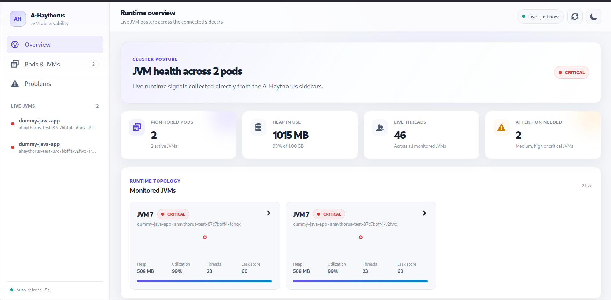

# A-Haythorus


A-Haythorus is a lightweight runtime observability sidecar focused today on JVM diagnosis in container and Kubernetes environments.

The current JVM adapter attaches to one target JVM in the Pod through the Java Attach API, reuses a JMX management connection, combines JVM telemetry with Linux process telemetry, keeps bounded history for analysis, serves a REST API and React UI, and can aggregate peer sidecars without requiring a central collector.

The long-term architecture deliberately separates generic process analysis from runtime-specific introspection so additional runtime analyzers can be introduced later.



---

## 1. Design goals

A-Haythorus is built around these principles:

- one sidecar monitors one target JVM process in the current Kubernetes deployment model
- no application instrumentation is required for JVM collection
- distinguish pairwise movement from behavior across time
- keep retained history bounded
- keep formulas explainable and configurable
- keep process-level CPU/I/O analysis runtime-neutral
- avoid a mandatory central aggregator
- isolate peer failures from local monitoring
- bound peer fan-out and peer-request concurrency
- make large Kubernetes namespaces partitionable with configurable sharding

A-Haythorus is intended as a diagnostic system rather than a replacement for a metrics platform:

```text
metrics platform -> what changed?
A-Haythorus      -> why might it have changed?
```

---

## 2. Current architecture

```text
                       Kubernetes namespace

 +---------------------------------------------------------+
 | Pod A                                                   |
 |                                                         |
 |  target JVM                                             |
 |      |                                                  |
 |      | Attach API / JMX                                 |
 |      v                                                  |
 |  JVM runtime adapter                                    |
 |      |                                                  |
 |      +-------- JVM-specific analysis                    |
 |                                                         |
 |  /proc/<pid>                                            |
 |      |                                                  |
 |      +-------- runtime-neutral process history          |
 |                    |                                    |
 |                    +-- CPU analyzer                     |
 |                    +-- I/O analyzer                     |
 |                                                         |
 |  JvmDataStore -> SnapshotService -> REST/UI             |
 +-------------------------------+-------------------------+
                                 |
                                 | peer HTTP
                                 v
                     other A-Haythorus sidecars
                                 ^
                                 |
                         Kubernetes API
                         membership discovery
```

There is no central push aggregator.

Public cluster requests may aggregate local state with discovered peers. Internal peer calls carry:

```text
X-A-Haythorus-Scope: local
```

so a peer returns only its local snapshot/history and does not recursively fan out again.

---

## 3. Collection model

The JVM collector gathers data such as:

- heap and non-heap memory
- memory pools
- garbage-collector counters
- thread count
- thread CPU time
- parsed thread dump
- deadlocks
- class histogram
- process CPU counters
- Linux process I/O counters
- timestamp

The default collection interval is:

```properties
collector.interval.ms=10000
```

Environment override:

```text
AH_COLLECTOR_INTERVAL_MS=10000
```

So the default cadence is **10 seconds**.

---

## 4. Bounded history

`JvmDataStore` keeps the latest rich snapshot plus bounded lightweight history.

```text
latest JvmSnapshot
  + heap / non-heap
  + memory pools
  + GC
  + histogram
  + thread data
  + process CPU / I/O
  + analysis results

bounded JvmHistorySample
  + timestamp
  + heap / non-heap / old-gen
  + GC counters
  + previous leak confidence
  + ProcessHistorySample
```

Default capacity:

```properties
history.max.samples=120
```

At a 10-second collection interval this represents approximately 20 minutes of retained lightweight history when continuously populated.

History capacity and analysis windows are independent. The analyzers select recent samples by timestamp rather than assuming a fixed sample count.

---

## 5. Runtime-neutral process analysis

The generic process boundary is `ProcessHistorySample`.

It contains cumulative OS/process counters such as:

```text
timestamp
cpuTimeNanos
availableProcessors
readCharacters
writeCharacters
readSyscalls
writeSyscalls
readBytes
writeBytes
```

The JVM-specific bridge converts `JvmSnapshot` into this generic process history. CPU and I/O analyzers therefore do not depend on JVM memory, GC, histograms, or thread internals.

Conceptually:

```text
A-Haythorus core
   |
   +-- Process / OS analysis
   |     +-- CPU analyzer
   |     +-- I/O analyzer
   |
   +-- Runtime-specific analysis
         +-- JVM memory / GC / histogram / threads
         +-- future Python runtime analyzer
         +-- future Node runtime analyzer
         +-- future native runtime analyzer
```

The generic analysis window defaults to:

```properties
analysis.window.seconds=60
```

Environment override:

```text
AH_ANALYSIS_WINDOW_SECONDS=60
```

---

## 6. Evidence model

A-Haythorus analysis uses normalized evidence values:

```text
0 <= E_i <= 1
```

Interpretation:

```text
0           observed signal with no suspicious evidence
1           strongest evidence for that signal
unavailable signal could not be evaluated
```

Unavailable evidence is excluded from the denominator rather than treated as zero.

For available signals with positive weights:

```text
             sum(w_i * E_i)
E_total = ---------------------
              sum(w_i)
```

Weights express **relative influence**, not measurement units.

Multiplying all weights by the same constant does not change the result.

Setting a weight to `0` disables that signal.

Negative weights are invalid.

Default weights are `1.0`.

---

## 7. JVM memory-retention heuristics

The memory analyzer is intentionally heuristic and should be interpreted as evidence strength, not proof of a memory leak.

### Heap retention

For interval movements `d_i`:

```text
persistence = positiveIntervals / totalIntervals
retention   = max(netGrowth, 0) / positiveGrowth
heapEvidence = (persistence + retention) / 2
```

### Old-generation retention

The same directional model is applied to resolved old-generation history:

```text
oldGenEvidence = (oldGenPersistence + oldGenRetention) / 2
```

If old-generation data is unavailable, the signal is excluded rather than counted as zero.

### GC reclaim evidence

When at least one GC occurred in the window:

```text
reclaimRatio   = reclaimedBytes / positiveGrowthBytes
retentionRatio = 1 - reclaimRatio
gcEvidence     = retentionRatio * heapPersistence
```

`reclaimRatio` is clamped to `[0,1]`.

If no GC occurred, GC evidence is unavailable because there was no observed collection opportunity to evaluate.

### Histogram evidence

Histogram aggregation is calculated from all matched-class deltas before top-N UI truncation:

```text
positiveBytes  = sum(max(classDelta, 0))
reclaimedBytes = sum(max(-classDelta, 0))

growthDominance = positiveBytes / (positiveBytes + reclaimedBytes)
topClassShare   = largestPositiveClassDelta / positiveBytes

histogramEvidence = (growthDominance + topClassShare) / 2
```

The four memory evidence signals are then combined through the weighted-evidence formula.

Configurable weights:

```properties
analysis.memory.heap-retention.weight=1.0
analysis.memory.old-gen-retention.weight=1.0
analysis.memory.gc-reclaim.weight=1.0
analysis.memory.histogram-growth.weight=1.0
```

Environment variables:

```text
AH_ANALYSIS_MEMORY_HEAP_RETENTION_WEIGHT
AH_ANALYSIS_MEMORY_OLD_GEN_RETENTION_WEIGHT
AH_ANALYSIS_MEMORY_GC_RECLAIM_WEIGHT
AH_ANALYSIS_MEMORY_HISTOGRAM_GROWTH_WEIGHT
```

---

## 8. Window maturity and historical confidence

A newly started analyzer should not immediately treat a partially observed window as fully mature.

```text
maturity = min(1, observedSeconds / leakWindowSeconds)
```

Current-window memory evidence is therefore:

```text
instantaneousLeakScore = normalizedEvidence * 100 * maturity
```

The historical leak confidence is smoothed using exponential weighting:

```text
L_t = alpha * E_t + (1 - alpha) * L_(t-1)
```

Default:

```properties
leak.window.seconds=60
leak.ewma.alpha=0.35
```

With the default alpha:

```text
L_t = 0.35 * E_t + 0.65 * L_(t-1)
```

Repeated substitution gives historical weights proportional to:

```text
alpha * (1 - alpha)^k
```

so older observations contribute progressively less.

The score is **memory-retention confidence**, not a mathematical probability that a leak exists.

Detailed math is maintained in [`LEAKAGE_SCORING_MODEL.md`](LEAKAGE_SCORING_MODEL.md).

---

## 9. CPU heuristic

For each valid process-history interval:

```text
U_i = deltaCpuTime / (deltaWallTime * availableProcessors)
```

`U_i` is clamped to `[0,1]`.

Across the configured analysis window:

```text
meanU      = mean(U_i)
peakU      = max(U_i)
persistence = peakU == 0 ? 0 : meanU / peakU
```

The CPU score is the weighted mean of normalized utilization and persistence:

```text
CPU evidence = weightedMean(meanU, persistence)
```

Default weights:

```properties
analysis.cpu.utilization.weight=1.0
analysis.cpu.persistence.weight=1.0
```

The UI label is **Sustained CPU pressure**.

High CPU is not automatically unhealthy; this score describes sustained recent utilization relative to process CPU capacity.

---

## 10. I/O heuristic

A-Haythorus reads Linux `/proc/<pid>/io` cumulative counters.

For each interval:

```text
storageRate = (delta read_bytes + delta write_bytes) / deltaTime
syscallRate = (delta readSyscalls + delta writeSyscalls) / deltaTime
```

For a positive rate series `x_i`:

```text
mean        = mean(x_i)
peak        = max(x_i)
persistence = peak == 0 ? 0 : mean / peak
intensity   = peak == 0 ? 0 : latest / peak
activity    = intensity * persistence
```

This is calculated independently for storage throughput and syscall activity and then combined through configurable weights.

```properties
analysis.io.storage-activity.weight=1.0
analysis.io.syscall-activity.weight=1.0
```

The result is **relative recent process activity**, not universal disk saturation or device pressure.

Additional derived diagnostics include average read/write payload per syscall and ratios comparing storage-attributed bytes with requested I/O characters.

---

## 11. Kubernetes peer discovery

Pods participating in A-Haythorus discovery carry a label such as:

```yaml
metadata:
  labels:
    a-haythorus.io/enabled: "true"
```

Default selector:

```properties
sidecar.discovery.label=a-haythorus.io/enabled=true
```

The sidecar queries the in-cluster Kubernetes API, filters running Pods, reads `status.podIP`, removes itself, optionally applies shard membership filtering, and converts the surviving Pods into peer URIs.

RBAC must permit Pod discovery:

```yaml
rules:
  - apiGroups: [""]
    resources: ["pods"]
    verbs: ["get", "list", "watch"]
```

---

## 12. Cluster sharding

Large namespaces should not force one UI-facing sidecar to contact every monitored Pod.

A-Haythorus can partition discovered Pods into deterministic shards:

```text
100 monitored Pods
        |
        v
configurable shard key
        |
        v
SHA-256
        |
        v
modulo shard count
        |
   +----+----+----+
   |         |    |
 shard 0  shard 1 ... shard N
```

When sharding is enabled, `KubernetesSidecarDiscovery` first resolves the local Pod's shard and then filters discovered peers using the same resolver:

```text
.filter(pod -> belongsToLocalShard(pod, localShard))
```

Therefore `ClusterSnapshotService` receives only same-shard peer URIs; it does not need to understand sharding itself.

### 12.1 Enable sharding

Sharding is disabled by default for backward compatibility.

Enable it with environment variables:

```yaml
env:
  - name: AH_CLUSTER_SHARDING_ENABLED
    value: "true"

  - name: AH_CLUSTER_SHARD_COUNT
    value: "10"

  - name: AH_CLUSTER_SHARD_ALGORITHM
    value: sha256-modulo

  - name: AH_CLUSTER_SHARD_KEY_FIELDS
    value: namespace,pod
```

Equivalent properties:

```properties
cluster.sharding.enabled=true
cluster.shard.count=10
cluster.shard.algorithm=sha256-modulo
cluster.shard.key-fields=namespace,pod
```

### 12.2 Supported shard-key fields

The key is configurable and may contain:

```text
namespace
pod
app
node
label:<kubernetes-label-name>
```

Examples:

```text
namespace,pod
app,pod
namespace,app,pod
node,pod
namespace,label:team,pod
```

The default is:

```text
namespace,pod
```

Including `pod` usually gives better distribution. A configuration such as only `app` is allowed but can concentrate all replicas of one application in the same shard; A-Haythorus logs a warning for key configurations without per-Pod identity.

### 12.3 Shard algorithm

Current algorithm:

```text
sha256-modulo
```

Conceptually:

```text
keyUtf8 -> SHA-256 -> first 8 bytes -> unsigned integer -> modulo shardCount
```

SHA-256 is used instead of Java `String.hashCode()` so future agents written in other languages can reproduce the same assignment.

Changing shard count can redistribute many Pods because modulo hashing is used in the first implementation. Consistent hashing is a future extension point.

### 12.4 Manual shard override

A Pod can override hashing with a Kubernetes label.

Default override label:

```text
a-haythorus.io/shard
```

Example:

```yaml
metadata:
  labels:
    a-haythorus.io/enabled: "true"
    a-haythorus.io/shard: "3"
```

With `AH_CLUSTER_SHARD_COUNT=10`, valid explicit shard IDs are `0` through `9`.

Override-label configuration:

```text
AH_CLUSTER_SHARD_OVERRIDE_LABEL=a-haythorus.io/shard
```

Manual override takes precedence over the configured hash key.

### 12.5 Missing key fields

Custom labels may not exist on every Pod.

Default policy:

```text
AH_CLUSTER_SHARD_MISSING_KEY_POLICY=fallback
```

`fallback` logs a warning and hashes the stable fallback key:

```text
namespace,pod
```

Strict mode:

```text
AH_CLUSTER_SHARD_MISSING_KEY_POLICY=reject
```

causes missing configured key data to fail shard resolution instead of silently falling back.

### 12.6 Example: team-aware sharding

```yaml
env:
  - name: AH_CLUSTER_SHARDING_ENABLED
    value: "true"
  - name: AH_CLUSTER_SHARD_COUNT
    value: "8"
  - name: AH_CLUSTER_SHARD_KEY_FIELDS
    value: namespace,label:team,pod
  - name: AH_CLUSTER_SHARD_MISSING_KEY_POLICY
    value: fallback
```

A Pod might carry:

```yaml
metadata:
  labels:
    team: checkout
```

Its effective key becomes conceptually:

```text
payments/checkout/orders-7d9df8
```

before hashing.

---

## 13. Bounded peer concurrency

Sharding reduces the **total** number of peers contacted by one cluster request. A separate concurrency limit bounds how many peer requests are in flight at the same time.

```text
peer requests in shard
        |
        v
virtual thread per task
        |
        v
bounded permit gate
        |
        v
at most N HTTP calls in flight
```

Default:

```properties
cluster.max.concurrent.requests=8
```

Environment variable:

```text
AH_CLUSTER_MAX_CONCURRENT_REQUESTS=8
```

Virtual threads remain useful because blocking is cheap, but cheap virtual threads do not make network calls, JSON parsing, sockets, memory allocation, or peer-side work free.

The concurrency bound protects the workload rather than treating virtual threads themselves as expensive.

Together:

```text
peerRequests ~= totalPods / shardCount
concurrentRequests <= maxConcurrentRequests
```

Peer connection and request timeouts are also configurable:

```properties
cluster.connect.timeout.ms=1000
cluster.request.timeout.ms=2000
```

---

## 14. Cluster request flow

Without sharding:

```text
Browser
  |
  v
Sidecar A
  |
  +-- local snapshot
  +-- discover all matching peers
  +-- fetch peers with bounded concurrency
```

With sharding:

```text
Browser
  |
  v
Sidecar A
  |
  +-- resolve local shard
  +-- discover Kubernetes Pods
  +-- keep only same-shard peers
  +-- fetch peers with bounded concurrency
```

Internal peer requests include:

```text
X-A-Haythorus-Scope: local
```

which prevents recursive peer aggregation.

A future API/UI change will make shard identity and explicit shard selection visible so a Kubernetes Service can route a user to a logical shard rather than making the observed shard depend on whichever sidecar receives the browser request.

---

## 15. REST API

Current routes include:

```text
GET /
GET /ui/
GET /api/v1/snapshot
GET /api/v1/history
GET /api/v1/jvms
GET /api/v1/jvms/{pid}
GET /api/v1/jvms/{pid}/memory
GET /api/v1/jvms/{pid}/memory-pools
GET /api/v1/jvms/{pid}/gc
GET /api/v1/jvms/{pid}/histogram
GET /api/v1/jvms/{pid}/threads
GET /api/v1/jvms/{pid}/thread-info
GET /api/v1/jvms/{pid}/thread-count
GET /api/v1/jvms/{pid}/thread-cpu-times
GET /api/v1/jvms/{pid}/analysis
GET /api/v1/jvms/{pid}/deadlocks
GET /api/v1/jvms/{pid}/timestamp
GET /api/v1/jvms/{pid}/history
```

Public `/api/v1/snapshot` and `/api/v1/history` requests aggregate peers. Requests carrying the internal local-scope header return local state only.

---

## 16. Configuration reference

| Property | Environment variable | Default | Purpose |
|---|---|---:|---|
| `runtime.mode` | `AH_RUNTIME_MODE` | `local` | local or Kubernetes discovery mode |
| `server.host` | `AH_SERVER_HOST` | `0.0.0.0` | HTTP bind address |
| `server.port` | `AH_SERVER_PORT` | `8899` | HTTP port |
| `sidecar.discovery.label` | `AH_DISCOVERY_LABEL` | `a-haythorus.io/enabled=true` | Kubernetes peer selector |
| `collector.interval.ms` | `AH_COLLECTOR_INTERVAL_MS` | `10000` | collection interval |
| `history.max.samples` | `AH_HISTORY_MAX_SAMPLES` | `120` | bounded history capacity |
| `analysis.window.seconds` | `AH_ANALYSIS_WINDOW_SECONDS` | `60` | process CPU/I/O analysis window |
| `leak.window.seconds` | `AH_LEAK_WINDOW_SECONDS` | `60` | JVM memory-analysis window |
| `leak.ewma.alpha` | `AH_LEAK_EWMA_ALPHA` | `0.35` | newest memory evidence weight |
| `cluster.connect.timeout.ms` | `AH_CLUSTER_CONNECT_TIMEOUT_MS` | `1000` | peer connect timeout |
| `cluster.request.timeout.ms` | `AH_CLUSTER_REQUEST_TIMEOUT_MS` | `2000` | peer request timeout |
| `cluster.max.concurrent.requests` | `AH_CLUSTER_MAX_CONCURRENT_REQUESTS` | `8` | maximum peer HTTP calls in flight |
| `cluster.sharding.enabled` | `AH_CLUSTER_SHARDING_ENABLED` | `false` | enable Kubernetes peer sharding |
| `cluster.shard.count` | `AH_CLUSTER_SHARD_COUNT` | `1` | logical shard count |
| `cluster.shard.algorithm` | `AH_CLUSTER_SHARD_ALGORITHM` | `sha256-modulo` | shard algorithm |
| `cluster.shard.key-fields` | `AH_CLUSTER_SHARD_KEY_FIELDS` | `namespace,pod` | fields used to form the shard key |
| `cluster.shard.override-label` | `AH_CLUSTER_SHARD_OVERRIDE_LABEL` | `a-haythorus.io/shard` | explicit shard label |
| `cluster.shard.missing-key-policy` | `AH_CLUSTER_SHARD_MISSING_KEY_POLICY` | `fallback` | fallback or reject missing key fields |

Analysis weights are also configurable through the memory, CPU, and I/O properties documented above.

---

## 17. Kubernetes deployment requirements

For the sidecar container to see and attach to the application JVM in the same Pod:

```yaml
spec:
  shareProcessNamespace: true
```

Typical downward-API environment values include:

```yaml
- name: POD_NAME
  valueFrom:
    fieldRef:
      fieldPath: metadata.name

- name: POD_NAMESPACE
  valueFrom:
    fieldRef:
      fieldPath: metadata.namespace

- name: NODE_NAME
  valueFrom:
    fieldRef:
      fieldPath: spec.nodeName

- name: POD_IP
  valueFrom:
    fieldRef:
      fieldPath: status.podIP
```

The sample Kubernetes manifest is under:

```text
k8s/deploy-test.yml
```

---

## 18. Build and run

Requirements:

- Java 25
- Maven
- Docker for container builds
- Node.js during frontend build

Java build:

```bash
mvn clean package -DskipTests
```

Container build:

```bash
docker build --no-cache -t a-haythorus:dev .
```

Kind development:

```bash
kind load docker-image a-haythorus:dev --name ahaythorus-dev
kubectl apply -f k8s/deploy-test.yml
kubectl get pods -n ahaythorus-test -o wide
```

Local API:

```bash
curl -s http://127.0.0.1:8899/api/v1/snapshot | jq
```

UI:

```text
http://127.0.0.1:8899/ui/
```

---

## 19. Failure isolation

A monitoring sidecar must not become more dangerous than the workload it observes.

Current protections include:

- bounded historical memory
- no historical retention of full thread dumps
- no historical retention of full histograms
- cleanup when target JVMs terminate
- short peer connection/request timeouts
- local fallback if peer discovery fails
- local-only peer scope to prevent recursive fan-out
- configurable Kubernetes sharding
- bounded peer-request concurrency

Future self-observability should expose peer requests in flight, queued requests, latency, failures, timeouts, and shard member counts so concurrency limits can be tuned from measurements rather than treated as permanent magic numbers.

---

## 20. Current limitations / next architecture steps

Important planned work includes:

- explicit shard identity and shard selection in REST/UI
- consistent hashing as an optional sharding algorithm
- cgroup-aware CPU quota and throttling analysis
- cgroup I/O analysis
- runtime-specific thread contention analysis
- slower independent cadence for expensive histogram collection
- process start time in JVM identity to guard against PID reuse
- validation of memory heuristics against deterministic healthy and leaking workloads
- additional runtime adapters beyond the JVM

---

## 21. Analysis mathematics

The detailed JVM memory-retention equations, symbol definitions, assumptions, weighting rules, window maturity, and smoothing model are documented in:

[`LEAKAGE_SCORING_MODEL.md`](LEAKAGE_SCORING_MODEL.md)

The key rule remains:

> A delta tells us movement. Diagnosis requires behavior across time.
